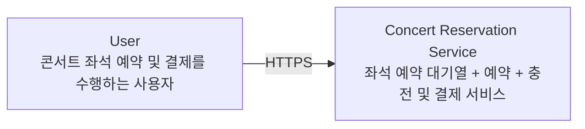
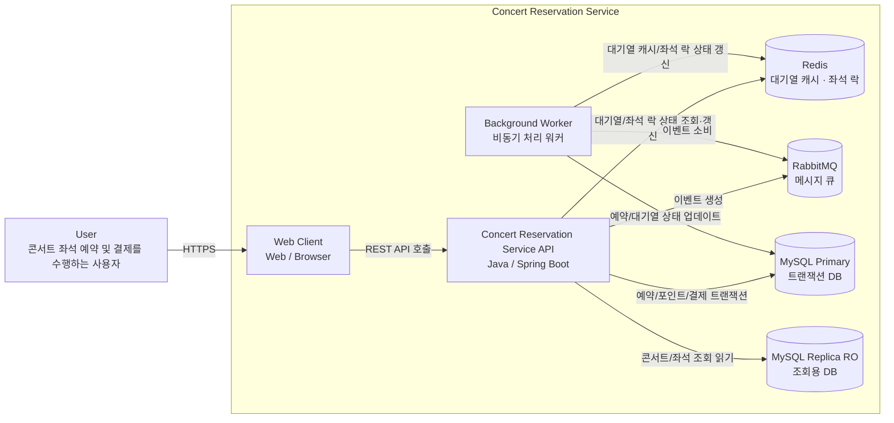
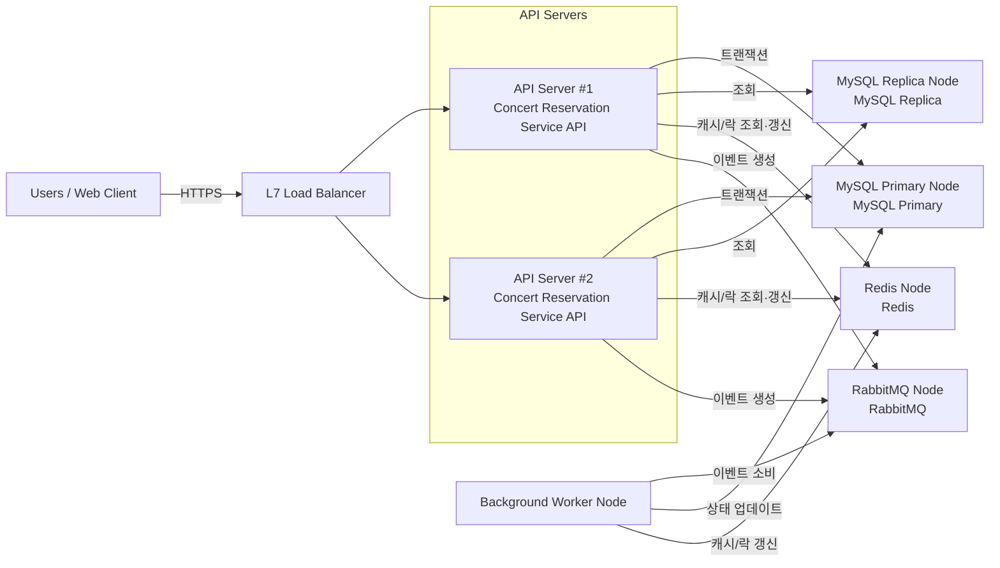

# INFRA & Structurizr DSL

> 상세 Structurizr DSL은 `(docs/7.서버구조설계-infra_구성도.dsl)` 파일에서 확인한다

## ✅ Structurizr DSL

### 1. System Context (User ↔ System)

### Container View (서비스 내부 구조)

### 3. Deployment View (Production 인프라)

